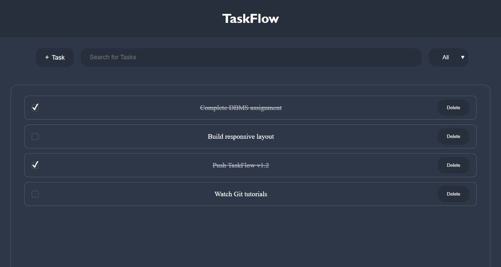
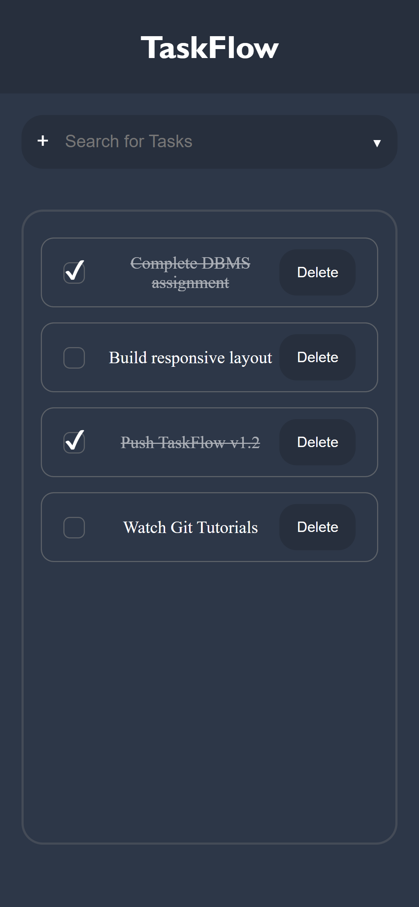
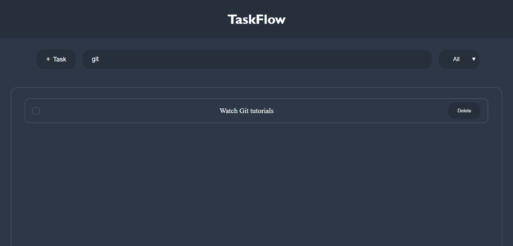
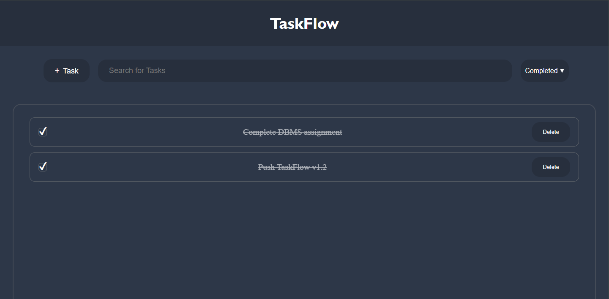
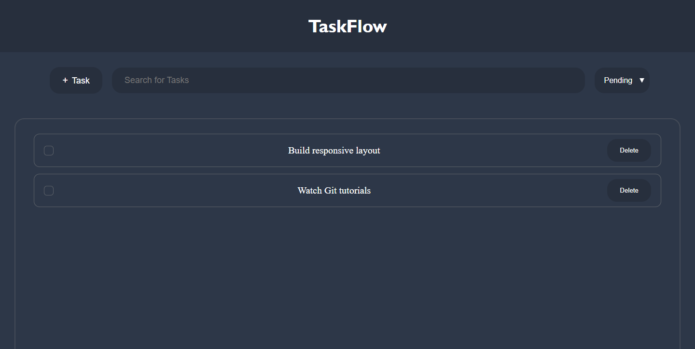
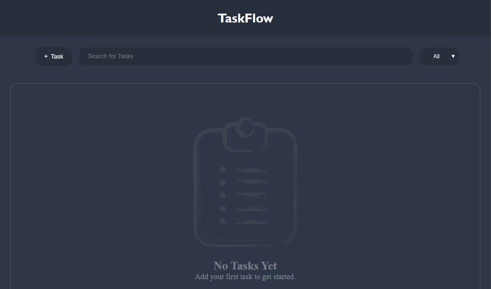

# TaskFlow

A modern task management web app built with HTML, CSS and Vanilla JavaScript.

---

## Features

- Add tasks
- Delete tasks
- Mark tasks as complete
- Search tasks
- Filter by All, Completed and Pending
- Local storage support
- Dynamic empty states
- Responsive dark UI

---

## Screenshots

### Desktop

### Mobile (iPhone 12 Pro)

### Search

### Completed Tasks

### Pending Tasks

### Empty State

---

## Tech Stack

- HTML
- CSS
- JavaScript
- Local Storage API

---

## Versions

### V1
- Task CRUD
- Search
- Filter
- Local storage

### V1.1
- Dynamic empty states
- Illustrations
- UX improvements

### V1.2
- Responsive mobile layout
- Mobile UX improvements
- Touch interaction improvements
- Task animations
- Overflow handling

### V2
- Edit tasks
- Task details modal
- Due dates
- Categories
- Priority system
- Task metadata
- UI polish
- Interaction improvements

---

## Author

Mohammed Muhsin P